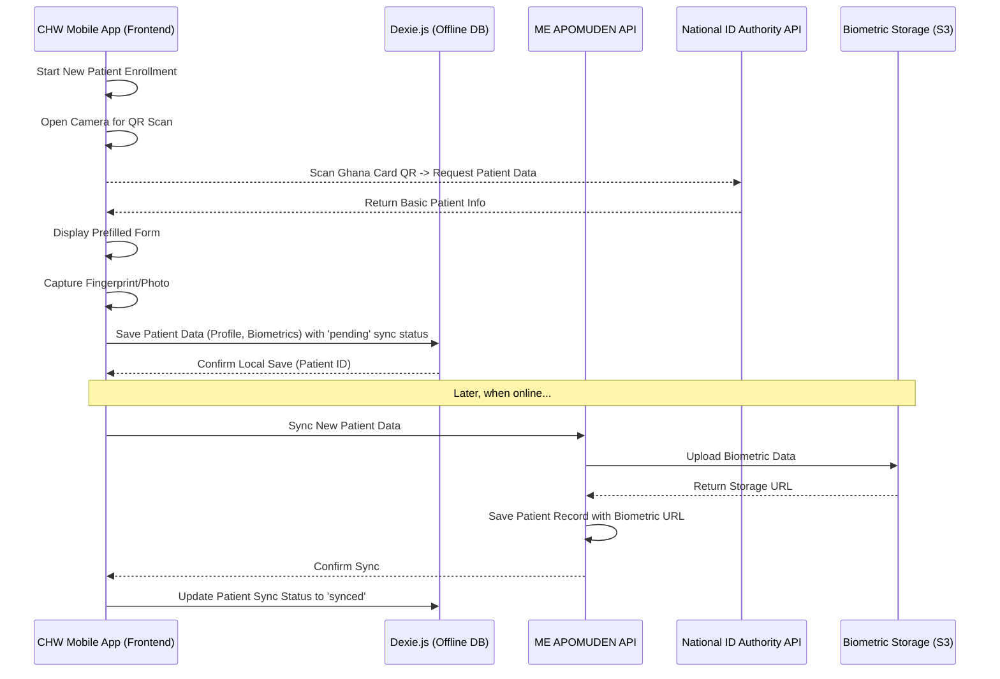
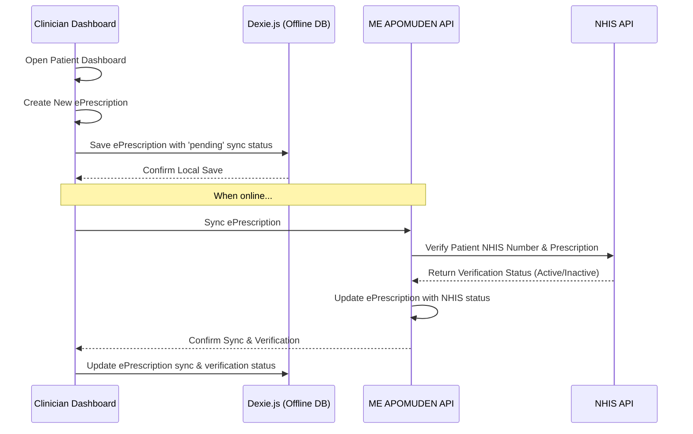
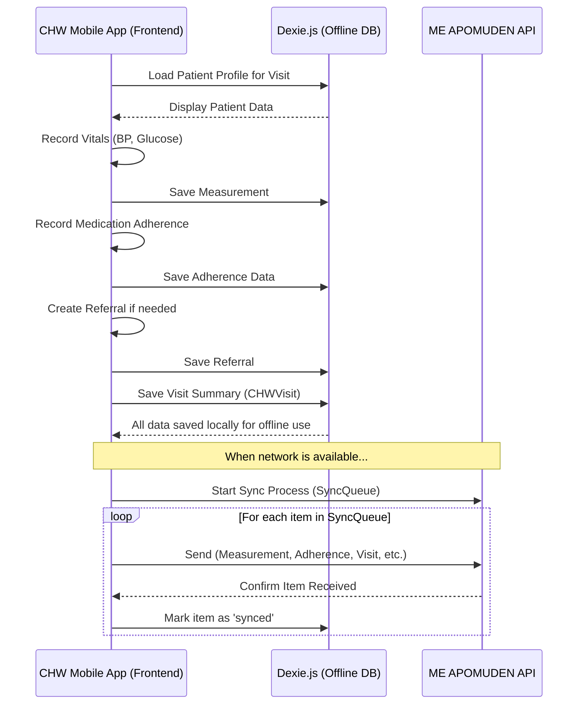
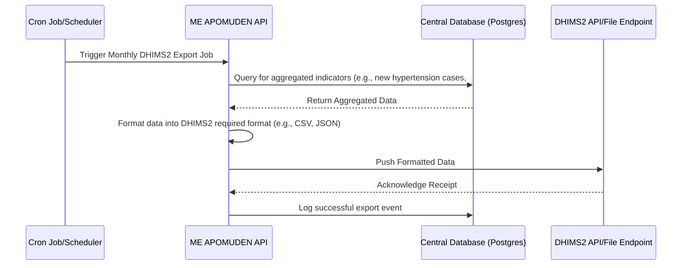

# ME APOMUDEN - Sequence Diagrams

This document illustrates the sequence of interactions for critical workflows within the ME APOMUDEN platform.

## 1. Patient Enrollment (by CHW)

This diagram shows the process of a CHW enrolling a new patient using a mobile device, including Ghana Card QR scan and biometric capture.

## 2. ePrescription & NHIS Verification

This diagram shows a clinician creating an e-prescription and the system verifying it against the NHIS database.

## 3. CHW Home Visit & Data Sync

This diagram shows a CHW conducting a home visit, recording data offline, and syncing it later.

## 4. DHIMS2 Data Export

This diagram shows the automated process of aggregating data and exporting it for DHIMS2.

