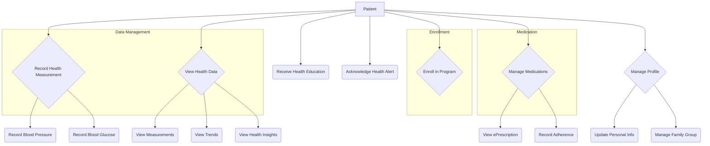
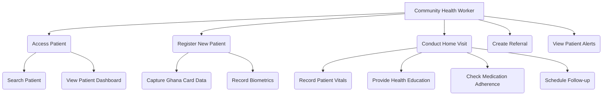
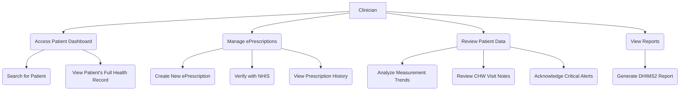
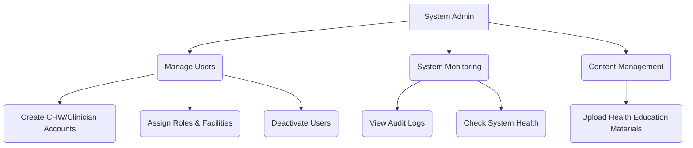

# ME APOMUDEN - Use Case Diagrams

This document outlines the primary use cases for the ME APOMUDEN platform, categorized by user role.

## 1. Patient Use Cases

## 2. Community Health Worker (CHW) Use Cases

## 3. Clinician Use Cases

## 4. System Administrator Use Cases

